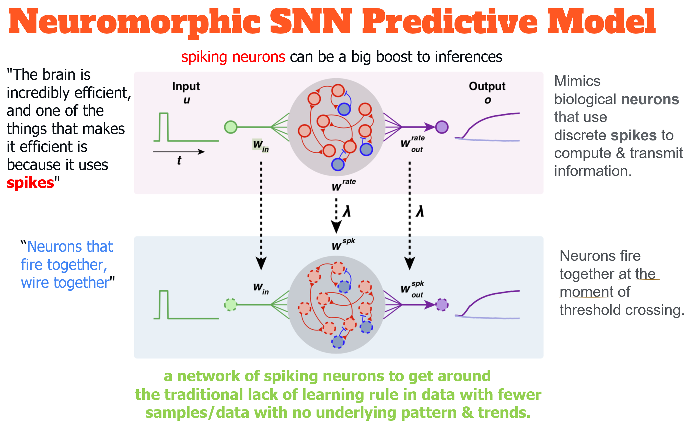

pynmsnn: NeuroMorphic Predictive Model with Spiking Neural Networks (SNN) in Python using Pytorch
=================================================================================================

**pynmsnn**

PyPI: https://pypi.org/project/pynmsnn/

**Related Blog:** https://towardsdatascience.com/design-a-neuromorphic-predictive-network-architecture-with-pytorch-72d523e16930

About pynmsnn
=============

`pynmsnn` is an open source, low-code library in python to build neuromorphic predictive models (Classification & Regression problems) using [Spiking Neural Networks (SNNs)] (https://en.wikipedia.org/wiki/Spiking_neural_network) at ease. It allows you to go from preparing your data to deploying your spiking model within minutes. SNNs are neural networks that mimics the biological brain. In the case of SNNs, the neurons accumulate the input activation until a threshold is reached, and when this threshold is reached, the neuron empties itself from it's activation and fire. Once empty, it should indeed take some [refractory period](https://en.wikipedia.org/wiki/Refractory_period_(physiology)) until it fires again, as it happen in the brain. 

pynmsnn is `simple`, `easy to use` and `low-code`.  It enables users to perform end-to-end Proof-Of-Concept (POC) experiments quickly and efficiently.

Who should use pynmsnn?
=======================

PYNMSNN is an open source library ideal for:-

- Citizen Data Scientists who prefer a low code solution.
- Experienced Data Scientists who want to increase model accuracy and improve productivity.
- Data Science Professionals and Consultants involved in building proof-of-concept (poc) projects.
- Researchers for quick poc testing.
- Students and Teachers.
- ML Enthusiasts.

Neuromorphic Design with SNN
============================

Neuromorphic design finds new life in machine learning. Neuromorphic architecture has had little practical success in building machines that can tackle standard tests such as logistic regression or image recognition. But lately it has been combined with the best of machine learning, and the networks of spiking neurons, bringing new hope for neuromorphic breakthroughs. Neuromorphic computing is an umbrella term given to a variety of efforts to build computation that resembles some aspect of the way the brain is formed. The brain is incredibly efficient, and one of the things that makes it efficient is because it uses spikes. If we can get a model of a spiking neurons as part of deep nets, it can be a big boost to inference, the task of making predictions, even on the energy-constrained edge computing devices such as mobile phones. 

SNN vs ANN
----------

In SNNs, there is a time axis and the neural network sees data througout time, and activation functions are spikes that are raised past a certain pre-activation threshold. Pre-activation values constantly fades if neurons aren't excited enough. Think of it like a time-distributed ReLU with spikes or no spikes at certain time steps.

Spiking Neural Networks (SNNs) are neural networks that are closer to what happens in the brain compared to what people usually code when doing Machine Learning and Deep Learning. In the case of SNNs, the neurons accumulate the input activation until a threshold is reached, and when this threshold is reached, the neuron empties itself from it's activation and fire. Once empty, it should indeed take some [refractory period](https://en.wikipedia.org/wiki/Refractory_period_(physiology)) until it fires again, as it happen in the brain.

This implies adding a **time axis** to Artificial Neural Networks (ANNs), where signal is accumulated throughout time in a pre-activation phase, then once a threshold is reached, signal is raised to the neurons above as a firing activation. At every moment, such as when the threshold isn't reached yet, the signal's pre-activation value fades.

For more detail information about SNNs you are recommended to watch [this interesting SNN animation](https://www.youtube.com/embed/3JQ3hYko51Y?start=120) which will quickly get you a feel of what it is (especially notice how neurons gets activated only gradually over time like a storm that fire together rather than statically from their inputs).

Why Neuromorphic Predictive Model?
----------------------------------

The concept is as given in the figure. 

How does it work?
-----------------

The neuron's firing method is through the following steps, where the argument `x` is an input:

Before anything, we need an initialize (or to empty) the state for each neuron upon starting predictions.

.. code:: python

    self.prev_inner = torch.zeros([batch_size, self.n_hidden]).to(self.device)
    self.prev_outer = torch.zeros([batch_size, self.n_hidden]).to(self.device)

Then, a weight matrix multiplies the input x, which is the input dataset. It is to be noted that x was modified to be flickering randomly through time (depending on the intensity of the original input x multiplied by a random uniform noise mask), or else x is already the output of a lower deep spiking layer:

.. code:: python

    input_excitation = self.fully_connected(x)

We then add the result to a decayed version of the information inside the neuron that we already had at the previous time step / time tick (Δt time elapsed). The `decay_multiplier` serves the purpose of slowly fading the inner activation such that we don't accumulate stimulis for too long to be able to have the neurons to rest. The `decay_multiplier` could have a value of 0.9 for example. Decay as such is also called exponential decay and yields an effect of [Exponential moving average](https://en.wikipedia.org/wiki/Moving_average#Exponential_moving_average) over time on the most recent values seen, which also affects the gradients upon backpropagating. So, by repeatedly multplying by 0.9 the inner activation through time, it decays and neurons unexcite themselves before firing. In this sense, it's now really true that "neurons that fire together wire together": when a pre-synaptic input is received closer to the moment of giving an output, that recentmost value will not have had the time to be decayed/faded. This way, the gradient of recent neurons that participated in exciting the current neuron that fired will be strong. Learning will be able to take place by gradient descent according to the decay's weighting's. So, in the opposite case, a stimuli that happened too long ago will suffer from vanishing gradients since it has been exponentially decayed down. So, it won't be useful in the learning process of backprop, which is what we want and respects the "neurons that fire together, wire together" idiom of Hebbian learning.

.. code:: python

    inner_excitation = input_excitation + self.prev_inner * self.decay_multiplier

Now, we compute the activation of the neurons to find their output value. We have a threshold to reach before having the neuron activating. The ReLU function might not be the most appropriate here, but just for a working prototype ReLU was used:

.. code:: python

    outer_excitation = F.relu(inner_excitation - self.threshold)

Now, the magic happens. If the neuron fires, the activation of the neuron is *subtracted to its inner state* to reset each neuron. First, this has the effect of resetting them to a resting position such that they won't be firing constantly upon being activated once. Second, resetting them as such will clip the gradient through time to isolate each firing events from each other. SNNs as such are truly inspired from the brain, as the natural neurons also have a refractory period: neurons, once they fire, will need to wait a bit before firing again even if fully excited by lower neurons they have as inputs. So here, I even subtracted a second penalty named `penalty_threshold` after each resetting `threshold`. Disclaimer:- I wasn't sure whether the negative part in the biological refractory period was on the outputs of the neurons or inside the neurons (e.g.: axon v.s. body?), so here I've simply put it inside. 
Let's see how I subtract this just when the neuron fires to have it to have a refractory period:

.. code:: python

    do_penalize_gate = (outer_excitation > 0).float()
    inner_excitation = inner_excitation - (self.penalty_threshold + outer_excitation) * do_penalize_gate

Finally, I return the previous output, simulating a small firing delay, which may not be useful in all the case, but which may be interesting to have if the SNN that is designed was ever to have Recurrent connections which would require time offsets in the connections from top layers near the outputs back into bottom layers near the input:

.. code:: python

    delayed_return_state = self.prev_inner
    delayed_return_output = self.prev_outer
    self.prev_inner = inner_excitation
    self.prev_outer = outer_excitation
    return delayed_return_state, delayed_return_output

Past that, to do the classification, the values of the classification output spiking neurons are averaged over the time axis so as to have one number per class to plug into the softmax cross entropy loss for classification as we know it and we backpropagate. This means the present SNN PyTorch class is reusable within any other feedforward neural network, as it repeats intputs over time with random noisy masks, and averages outputs over time.  

Basically, the neurons' activation must decay through time, and fire only when getting past a certain threshold. 

Requirements
============

-  **Python 3.6.x**
-  torch[>=1.4.0]
-  NumPy[>=1.9.0]
-  SciPy[>=0.14.0]
-  Scikit-learn[>=0.16]
-  Pandas[>=0.23.0]
-  Xgboost[>=1.4.1]
-  Matplotlib
-  Seaborn[0.9.0]
-  Plot-metric
-  regressormetricgraphplot
-  tqdm

Quickly Setup package with automation scripts
=============================================

.. code:: bash

    sudo bash setup.sh

Installation
------------
Using pip:

.. code:: sh

    pip install pynmsnn

.. code:: bash

    $ git clone https://github.com/ajayarunachalam/pynmsnn
    $ cd pynmsnn
    $ python setup.py install

Using notebook:

.. code:: sh

    !pip install pynmsnn

Getting started
===============

-  **DEMO:**

Example Binary Classification: Synthetic dataset
------------------------------------------------

.. code:: python

    __author__ = 'Ajay Arunachalam'
    __version__ = '0.0.1'
    __date__ = '19.7.2021'

	import numpy as np
	import pandas as pd
	import seaborn as sns
	import matplotlib.pyplot as plt
	%matplotlib inline
	import torch
	import torch.nn as nn
	import torch.optim as optim
	from torch.utils.data import Dataset, DataLoader
	from sklearn.preprocessing import StandardScaler, MinMaxScaler    
	from sklearn.model_selection import train_test_split
	from sklearn.metrics import confusion_matrix, classification_report
	from sklearn.datasets import make_classification
	from pyNM.cf_matrix import make_confusion_matrix
	from pyNM.spiking_binary_classifier import *
	from plot_metric.functions import MultiClassClassification, BinaryClassification

	#fixing random state
	random_state=1234

	# Generate 2 class dataset
	X, Y = make_classification(n_samples=10000, n_classes=2, weights=[1,1], random_state=1)
	# split into train/test sets
	#X_train, X_test, y_train, y_test = train_test_split(X, y, test_size=0.5, random_state=2)

	# Load dataset (we just selected 4 classes of digits)
	#X, Y = load_digits(n_class=4, return_X_y=True)

	print(f'Predictors: {X}')

	print(f'Outcome: {Y}')

	print(f'Distribution of target:')
	print(pd.value_counts(Y))

	# Add noisy features to make the problem more harder
	random_state = np.random.RandomState(123)
	n_samples, n_features = X.shape
	X = np.c_[X, random_state.randn(n_samples, 1000 * n_features)]

	## Spliting data into train and test sets.
	X, X_test, y, y_test = train_test_split(X, Y, test_size=0.4,
	                                        random_state=123)

	## Spliting train data into training and validation sets.
	X_train, X_valid, y_train, y_valid = train_test_split(X, y, test_size=0.2,
	                                                      random_state=1)

	print('Data shape:')
	print('X_train: %s, X_valid: %s, X_test: %s \n' %(X_train.shape, X_valid.shape,
	                                                  X_test.shape))

	# Scale data to have mean '0' and variance '1' 
	# which is importance for convergence of the neural network
	scaler = StandardScaler()
	X_train = scaler.fit_transform(X_train)
	X_valid = scaler.transform(X_valid)
	X_test = scaler.transform(X_test)

	X_train, y_train = np.array(X_train), np.array(y_train)

	X_valid, y_valid = np.array(X_valid), np.array(y_valid)

	X_test, y_test = np.array(X_test), np.array(y_test)

	EPOCHS = 50
	BATCH_SIZE = 64
	LEARNING_RATE = 0.001

	## train data
	class trainData(Dataset):
	    
	    def __init__(self, X_data, y_data):
	        self.X_data = X_data
	        self.y_data = y_data
	        
	    def __getitem__(self, index):
	        return self.X_data[index], self.y_data[index]
	        
	    def __len__ (self):
	        return len(self.X_data)

	train_data = trainData(torch.FloatTensor(X_train), 
	                       torch.FloatTensor(y_train))

	## validation data

	class valData(Dataset):
	    def __init__(self, X_data, y_data):
	        self.X_data = X_data
	        self.y_data = y_data
	        
	    def __getitem__(self, index):
	        return self.X_data[index], self.y_data[index]
	        
	    def __len__ (self):
	        return len(self.X_data)
	    
	val_data = valData(torch.FloatTensor(X_valid), 
	                       torch.FloatTensor(y_valid))

	## test data    
	class testData(Dataset):
	    
	    def __init__(self, X_data):
	        self.X_data = X_data
	        
	    def __getitem__(self, index):
	        return self.X_data[index]
	        
	    def __len__ (self):
	        return len(self.X_data)
	    

	test_data = testData(torch.FloatTensor(X_test))

	train_loader = DataLoader(dataset=train_data, batch_size=BATCH_SIZE, shuffle=True)
	val_loader = DataLoader(dataset=val_data, batch_size=BATCH_SIZE, shuffle=True)
	test_loader = DataLoader(dataset=test_data, batch_size=1)

	device = torch.device("cuda:0" if torch.cuda.is_available() else "cpu")
	print(device)

	model = SpikingNeuralNetwork(device, X_train.shape[1], n_time_steps=500, begin_eval=0)
	model.to(device)
	print(model)
	criterion = nn.BCEWithLogitsLoss()
	optimizer = optim.Adam(model.parameters(), lr=LEARNING_RATE)

	def binary_acc(y_pred, y_test):

    	y_pred_tag = torch.round(torch.sigmoid(y_pred))

    	correct_results_sum = (y_pred_tag == y_test).sum().float()
    	acc = correct_results_sum/y_test.shape[0]
    	acc = torch.round(acc * 100)
    
    	return acc

	model.train()
	for e in range(1,EPOCHS+1):
	    epoch_loss = 0
	    epoch_acc = 0
	    for X_batch, y_batch in train_loader:
	        X_batch, y_batch = X_batch.to(device), y_batch.to(device)
	        optimizer.zero_grad()
	        y_pred = model(X_batch)
	        loss = criterion(y_pred, y_batch.unsqueeze(1))
	        acc = binary_acc(y_pred, y_batch.unsqueeze(1))
	        
	        loss.backward()
	        optimizer.step()
	        
	        epoch_loss += loss.item()
	        epoch_acc += acc.item()

	    print(f'Epoch {e+0:03}: | Loss: {epoch_loss/len(train_loader):.5f} | Acc: {epoch_acc/len(train_loader):.3f}')

	y_pred_list = []
	model.eval()
	with torch.no_grad():
	    for X_batch in test_loader:
	        X_batch = X_batch.to(device)
	        y_test_pred = model(X_batch)
	        y_test_pred = torch.sigmoid(y_test_pred)
	        y_pred_tag = torch.round(y_test_pred)
	        y_pred_list.append(y_pred_tag.cpu().numpy())

	y_pred_list = [a.squeeze().tolist() for a in y_pred_list]

	#Get the confusion matrix
	cf_matrix = confusion_matrix(y_test, y_pred_list)
	print(cf_matrix)
	make_confusion_matrix(cf_matrix, figsize=(8,6), cbar=False, title='CF Matrix')

	print(classification_report(y_test, y_pred_list))

	# report
	# Visualisation of plots
	bc = BinaryClassification(y_test, y_pred_list, labels=[0, 1])
	# Figures
	plt.figure(figsize=(15,10))
	plt.subplot2grid(shape=(2,6), loc=(0,0), colspan=2)
	bc.plot_roc_curve()
	plt.subplot2grid((2,6), (0,2), colspan=2)
	bc.plot_precision_recall_curve()
	plt.subplot2grid((2,6), (0,4), colspan=2)
	bc.plot_class_distribution()
	plt.subplot2grid((2,6), (1,1), colspan=2)
	bc.plot_confusion_matrix()
	plt.subplot2grid((2,6), (1,3), colspan=2)
	bc.plot_confusion_matrix(normalize=True)

	# Save figure
	plt.savefig('./example_binary_classification.png')

	# Display Figure
	plt.show()
	plt.close()

	# Full report of the classification
	bc.print_report()

	# Example custom param using dictionnary
	param_pr_plot = {
	    'c_pr_curve':'blue',
	    'c_mean_prec':'cyan',
	    'c_thresh_lines':'red',
	    'c_f1_iso':'green',
	    'beta': 2,
	}

	plt.figure(figsize=(6,6))
	bc.plot_precision_recall_curve(**param_pr_plot)

	# Save figure
	plt.savefig('./example_binary_class_PRCurve_custom.png')

	# Display Figure
	plt.show()
	plt.close()

Example MultiClass Classification: IRIS dataset
------------------------------------------------

.. code:: python

    __author__ = 'Ajay Arunachalam'
    __version__ = '0.0.1'
    __date__ = '19.7.2021'

    from pyNM.spiking_multiclass_classifier import *
    import torch
    import torch.nn.functional as F
    import torch.nn as nn
    from torch.autograd import Variable
    from torch.utils.data import Dataset, DataLoader
    import torch.optim as optim
    import numpy as np
    import pandas as pd
    import matplotlib.pyplot as plt
    from sklearn.decomposition import PCA
    from sklearn.preprocessing import LabelEncoder, OneHotEncoder
    from sklearn.preprocessing import StandardScaler, MinMaxScaler    
    from sklearn.model_selection import train_test_split
    from sklearn.metrics import accuracy_score, precision_score, recall_score
    from sklearn.metrics import mean_squared_error, r2_score
    from sklearn.linear_model import LinearRegression
    from sklearn.ensemble import RandomForestRegressor
    from xgboost import XGBRegressor
    from tqdm.notebook import tqdm
    from sklearn.datasets import load_iris
    from sklearn.metrics import roc_curve, auc
    from sklearn.metrics import confusion_matrix
    from pyNM.cf_matrix import make_confusion_matrix
    from plot_metric.functions import MultiClassClassification
    import seaborn as sns
    from random import *
    get_ipython().run_line_magic('matplotlib', 'inline')

    def run_classifier():
        torch.multiprocessing.freeze_support()
        device = torch.device("cuda" if torch.cuda.is_available() else "cpu")
        print(device)

        # load iris dataset
        iris_df = pd.read_csv('../data/iris_data.csv')
        print(iris_df.shape)
        print(iris_df.head())

        # transforming target/class to numeric

        #iris_df.loc[iris_df.species=='Iris-setosa','species'] = 0
        #iris_df.loc[iris_df.species=='Iris-versicolor','species'] = 1
        #iris_df.loc[iris_df.species=='Iris-virginica','species'] = 2

        #checking class distribution
        iris_df['target'].value_counts().plot.bar(legend='Class Distribution')

        # final dataset

        X = iris_df.iloc[:,0:4]
        y = iris_df.iloc[:,4]
        #print(y)
       
        # Scale data to have mean '0' and variance '1' 
        # which is importance for convergence of the neural network
        scaler = StandardScaler()
        X_scaled = scaler.fit_transform(X)
        
        # Split the data set into training and testing
        X_train, X_test, y_train, y_test = train_test_split(X_scaled, y.values.astype(float), test_size=0.2, random_state=2)
        
        #####################
        spiking_model = SpikingNeuralNetwork(device, X_train.shape[1], num_class=3, n_time_steps=64, begin_eval=0)
        #####################
        optimizer = torch.optim.Adam(spiking_model.parameters(), lr=0.001)
        #optimizer = torch.optim.SGD(model.parameters(), lr=0.01)
        loss_fn   = nn.CrossEntropyLoss()
        print(spiking_model)
        
        # Train the model
        EPOCHS  = 100
        X_train = Variable(torch.from_numpy(X_train)).float()
        y_train = Variable(torch.from_numpy(y_train)).long()
        X_test  = Variable(torch.from_numpy(X_test)).float()
        y_test  = Variable(torch.from_numpy(y_test)).long()

        loss_list     = np.zeros((EPOCHS,))
        accuracy_list = np.zeros((EPOCHS,))

        for epoch in tqdm(range(EPOCHS)): 
            y_pred = spiking_model(X_train) #model
            #print(y_pred)
            loss = loss_fn(y_pred, y_train)
            loss_list[epoch] = loss.item()

            # Zero gradients
            optimizer.zero_grad()
            loss.backward()
            optimizer.step()

            with torch.no_grad():
                y_pred = spiking_model(X_test) #model
                correct = (torch.argmax(y_pred, dim=1) == y_test).type(torch.FloatTensor)
                accuracy_list[epoch] = correct.mean()
        
             
            if epoch % 10 == 0:
                print('number of epoch', epoch, 'loss', loss.item()) 
                print('number of epoch', epoch, 'accuracy', correct[0])
            
        # Plot Accuracy and Loss from Training
        fig, (ax1, ax2) = plt.subplots(2, figsize=(12, 6), sharex=True)

        ax1.plot(accuracy_list)
        ax1.set_ylabel("validation accuracy")
        ax2.plot(loss_list)
        ax2.set_ylabel("validation loss")
        ax2.set_xlabel("epochs");
        
        
        # Show ROC Curve
        plt.figure(figsize=(10, 10))
        plt.plot([0, 1], [0, 1], 'k--')

        # One hot encoding
        enc = OneHotEncoder()
        Y_onehot = enc.fit_transform(y_test[:, np.newaxis]).toarray()

        with torch.no_grad():
            y_pred = spiking_model(X_test).numpy() #model
            #pred = torch.argmax(y_pred).type(torch.FloatTensor)
            fpr, tpr, threshold = roc_curve(Y_onehot.ravel(), y_pred.ravel())

        plt.plot(fpr, tpr, label='AUC = {:.3f}'.format(auc(fpr, tpr)))
        plt.xlabel('False positive rate')
        plt.ylabel('True positive rate')
        plt.title('ROC curve')
        plt.legend();
        
        print(y_test)
        print(np.argmax(y_pred, axis=1))
        y_pred_ = np.argmax(y_pred, axis=1)
        
        #Get the confusion matrix
        cf_matrix = confusion_matrix(y_test, y_pred_)
        print(cf_matrix)
        make_confusion_matrix(cf_matrix, figsize=(8,6), cbar=False, title='IRIS CF Matrix')
        
        # report
        # Visualisation of plots
        mc = MultiClassClassification(y_test, y_pred, labels=[0, 1, 2])
        plt.figure(figsize=(13,4))
        plt.subplot(131)
        mc.plot_roc()
        plt.subplot(132)
        mc.plot_confusion_matrix()
        plt.subplot(133)
        mc.plot_confusion_matrix(normalize=True)

        plt.savefig('../figures/images/plot_multi_classification.png')
        plt.show()

        mc.print_report()

    if (__name__ == '__main__'):
        run_classifier()

Example MultiClass Classification: MNIST dataset
------------------------------------------------

.. code:: python

    import os
    import matplotlib.pyplot as plt
    import torchvision.datasets
    import torch
    import torch.nn as nn
    import torch.nn.functional as F
    import torch.optim as optim
    import torchvision.transforms as transforms
    from torch.autograd import Variable
    import numpy as np
    import pandas as pd

    def train(model, device, train_set_loader, optimizer, epoch, logging_interval=100):   
        model.train()
        for batch_idx, (data, target) in enumerate(train_set_loader):
            data, target = data.to(device), target.to(device)
            optimizer.zero_grad()
            output = model(data)
            loss = F.nll_loss(output, target)
            loss.backward()
            optimizer.step()
            
            if batch_idx % logging_interval == 0:
                pred = output.max(1, keepdim=True)[1]  # get the index of the max log-probability
                correct = pred.eq(target.view_as(pred)).float().mean().item()
                print('Train Epoch: {} [{}/{} ({:.0f}%)] Loss: {:.6f} Accuracy: {:.2f}%'.format(
                    epoch, batch_idx * len(data), len(train_set_loader.dataset),
                    100. * batch_idx / len(train_set_loader), loss.item(),
                    100. * correct))

    def train_many_epochs(model): 
        epoch = 1
        optimizer = optim.SGD(model.parameters(), lr=0.1, momentum=0.5)
        train(model, device, train_set_loader, optimizer, epoch, logging_interval=10)
        test(model, device, test_set_loader)

        epoch = 2
        optimizer = optim.SGD(model.parameters(), lr=0.05, momentum=0.5)
        train(model, device, train_set_loader, optimizer, epoch, logging_interval=10)
        test(model, device, test_set_loader)

        epoch = 3
        optimizer = optim.SGD(model.parameters(), lr=0.01, momentum=0.5)
        train(model, device, train_set_loader, optimizer, epoch, logging_interval=10)
        test(model, device, test_set_loader)
                
    def test(model, device, test_set_loader):
        model.eval()
        test_loss = 0
        correct = 0
        
        with torch.no_grad():
            for data, target in test_set_loader:
                data, target = data.to(device), target.to(device)
                output = model(data)
                # Note: with `reduce=True`, I'm not sure what would happen with a final batch size 
                # that would be smaller than regular previous batch sizes. For now it works.
                test_loss += F.nll_loss(output, target, reduce=True).item() # sum up batch loss
                pred = output.max(1, keepdim=True)[1] # get the index of the max log-probability
                correct += pred.eq(target.view_as(pred)).sum().item()

        test_loss /= len(test_set_loader.dataset)
        print("")
        print('Test set: Average loss: {:.4f}, Accuracy: {}/{} ({:.2f}%)'.format(
            test_loss, 
            correct, len(test_set_loader.dataset),
            100. * correct / len(test_set_loader.dataset)))
        print("")

    def download_mnist(data_path):
        if not os.path.exists(data_path):
            os.mkdir(data_path)
        transformation = transforms.Compose([transforms.ToTensor(), transforms.Normalize((0.5,), (1.0,))])
        training_set = torchvision.datasets.MNIST(data_path, train=True, transform=transformation, download=True)
        testing_set = torchvision.datasets.MNIST(data_path, train=False, transform=transformation, download=True)
        return training_set, testing_set

    batch_size = 1000
    DATA_PATH = './data' #set your data path here

    training_set, testing_set = download_mnist(DATA_PATH)
    train_set_loader = torch.utils.data.DataLoader(
        dataset=training_set,
        batch_size=batch_size,
        shuffle=True)
    test_set_loader = torch.utils.data.DataLoader(
        dataset=testing_set,
        batch_size=batch_size,
        shuffle=False)

    # Use GPU wherever possible!
    use_cuda = torch.cuda.is_available()
    device = torch.device("cuda" if use_cuda else "cpu")
    print(device)

    class SpikingNeuronLayer(nn.Module):
        
        def __init__(self, device, n_inputs=28*28, n_hidden=100, decay_multiplier=0.9, threshold=2.0, penalty_threshold=2.5):
            super(SpikingNeuronLayer, self).__init__()
            self.device = device
            self.n_inputs = n_inputs
            self.n_hidden = n_hidden
            self.decay_multiplier = decay_multiplier
            self.threshold = threshold
            self.penalty_threshold = penalty_threshold
            
            self.fc = nn.Linear(n_inputs, n_hidden)
            
            self.init_parameters()
            self.reset_state()
            self.to(self.device)
            
        def init_parameters(self):
            for param in self.parameters():
                if param.dim() >= 2:
                    nn.init.xavier_uniform_(param)
            
        def reset_state(self):
            self.prev_inner = torch.zeros([self.n_hidden]).to(self.device)
            self.prev_outer = torch.zeros([self.n_hidden]).to(self.device)

        def forward(self, x):
            """
            Call the neuron at every time step.
            
            x: activated_neurons_below
            
            return: a tuple of (state, output) for each time step. Each item in the tuple
            are then themselves of shape (batch_size, n_hidden) and are PyTorch objects, such 
            that the whole returned would be of shape (2, batch_size, n_hidden) if casted.
            """
            if self.prev_inner.dim() == 1:
                # Adding batch_size dimension directly after doing a `self.reset_state()`:
                batch_size = x.shape[0]
                self.prev_inner = torch.stack(batch_size * [self.prev_inner])
                self.prev_outer = torch.stack(batch_size * [self.prev_outer])
            
            # 1. Weight matrix multiplies the input x
            input_excitation = self.fc(x)
            
            # 2. We add the result to a decayed version of the information we already had.
            inner_excitation = input_excitation + self.prev_inner * self.decay_multiplier
            
            # 3. We compute the activation of the neuron to find its output value, 
            #    but before the activation, there is also a negative bias that refrain thing from firing too much.
            outer_excitation = F.relu(inner_excitation - self.threshold)
            
            # 4. If the neuron fires, the activation of the neuron is subtracted to its inner state 
            #    (and with an extra penalty for increase refractory time), 
            #    because it discharges naturally so it shouldn't fire twice. 
            do_penalize_gate = (outer_excitation > 0).float()
            # TODO: remove following /2?
            inner_excitation = inner_excitation - (self.penalty_threshold/self.threshold * inner_excitation) * do_penalize_gate
            
            # 5. The outer excitation has a negative part after the positive part. 
            outer_excitation = outer_excitation #+ torch.abs(self.prev_outer) * self.decay_multiplier / 2.0
            
            # 6. Setting internal values before returning. 
            #    And the returning value is the one of the previous time step to delay 
            #    activation of 1 time step of "processing" time. For logits, we don't take activation.
            delayed_return_state = self.prev_inner
            delayed_return_output = self.prev_outer
            self.prev_inner = inner_excitation
            self.prev_outer = outer_excitation
            return delayed_return_state, delayed_return_output

    class InputDataToSpikingPerceptronLayer(nn.Module):
        
        def __init__(self, device):
            super(InputDataToSpikingPerceptronLayer, self).__init__()
            self.device = device
            
            self.reset_state()
            self.to(self.device)
            
        def reset_state(self):
            #     self.prev_state = torch.zeros([self.n_hidden]).to(self.device)
            pass
        
        def forward(self, x, is_2D=True):
            x = x.view(x.size(0), -1)  # Flatten 2D image to 1D for FC
            random_activation_perceptron = torch.rand(x.shape).to(self.device)
            return random_activation_perceptron * x

    class OutputDataToSpikingPerceptronLayer(nn.Module):
        
        def __init__(self, average_output=True):
            """
            average_output: might be needed if this is used within a regular neural net as a layer.
            Otherwise, sum may be numerically more stable for gradients with setting average_output=False.
            """
            super(OutputDataToSpikingPerceptronLayer, self).__init__()
            if average_output:
                self.reducer = lambda x, dim: x.sum(dim=dim)
            else:
                self.reducer = lambda x, dim: x.mean(dim=dim)
        
        def forward(self, x):
            if type(x) == list:
                x = torch.stack(x)
            return self.reducer(x, 0)

    class SpikingNeuralNetwork(nn.Module):
        
        def __init__(self, device, n_time_steps, begin_eval):
            super(SpikingNeuralNetwork, self).__init__()
            assert (0 <= begin_eval and begin_eval < n_time_steps)
            self.device = device
            self.n_time_steps = n_time_steps
            self.begin_eval = begin_eval
            
            self.input_conversion = InputDataToSpikingPerceptronLayer(device)
            
            self.layer1 = SpikingNeuronLayer(
                device, n_inputs=28*28, n_hidden=100,
                decay_multiplier=0.9, threshold=1.0, penalty_threshold=1.5
            )
            
            self.layer2 = SpikingNeuronLayer(
                device, n_inputs=100, n_hidden=10,
                decay_multiplier=0.9, threshold=1.0, penalty_threshold=1.5
            )
            
            self.output_conversion = OutputDataToSpikingPerceptronLayer(average_output=False)  # Sum on outputs.
            
            self.to(self.device)
        
        def forward_through_time(self, x):
            """
            This acts as a layer. Its input is non-time-related, and its output too.
            So the time iterations happens inside, and the returned layer is thus
            passed through global average pooling on the time axis before the return 
            such as to be able to mix this pipeline with regular backprop layers such
            as the input data and the output data.
            """
            self.input_conversion.reset_state()
            self.layer1.reset_state()
            self.layer2.reset_state()

            out = []
            
            all_layer1_states = []
            all_layer1_outputs = []
            all_layer2_states = []
            all_layer2_outputs = []
            for _ in range(self.n_time_steps):
                xi = self.input_conversion(x)
                
                # For layer 1, we take the regular output.
                layer1_state, layer1_output = self.layer1(xi)
                
                # We take inner state of layer 2 because it's pre-activation and thus acts as out logits.
                layer2_state, layer2_output = self.layer2(layer1_output)
                
                all_layer1_states.append(layer1_state)
                all_layer1_outputs.append(layer1_output)
                all_layer2_states.append(layer2_state)
                all_layer2_outputs.append(layer2_output)
                out.append(layer2_state)
                
            out = self.output_conversion(out[self.begin_eval:])
            return out, [[all_layer1_states, all_layer1_outputs], [all_layer2_states, all_layer2_outputs]]
        
        def forward(self, x):
            out, _ = self.forward_through_time(x)
            return F.log_softmax(out, dim=-1)

        def visualize_all_neurons(self, x):
            assert x.shape[0] == 1 and len(x.shape) == 4, (
                "Pass only 1 example to SpikingNeuralNetwork.visualize(x) with outer dimension shape of 1.")
            _, layers_state = self.forward_through_time(x)

            for i, (all_layer_states, all_layer_outputs) in enumerate(layers_state):
                layer_state  =  torch.stack(all_layer_states).data.cpu().numpy().squeeze().transpose()
                layer_output = torch.stack(all_layer_outputs).data.cpu().numpy().squeeze().transpose()
                
                self.plot_layer(layer_state, title="Inner state values of neurons for layer {}".format(i))
                self.plot_layer(layer_output, title="Output spikes (activation) values of neurons for layer {}".format(i))
        
        def visualize_neuron(self, x, layer_idx, neuron_idx):
            assert x.shape[0] == 1 and len(x.shape) == 4, (
                "Pass only 1 example to SpikingNeuralNetwork.visualize(x) with outer dimension shape of 1.")
            _, layers_state = self.forward_through_time(x)

            all_layer_states, all_layer_outputs = layers_state[layer_idx]
            layer_state  =  torch.stack(all_layer_states).data.cpu().numpy().squeeze().transpose()
            layer_output = torch.stack(all_layer_outputs).data.cpu().numpy().squeeze().transpose()

            self.plot_neuron(layer_state[neuron_idx], title="Inner state values neuron {} of layer {}".format(neuron_idx, layer_idx))
            self.plot_neuron(layer_output[neuron_idx], title="Output spikes (activation) values of neuron {} of layer {}".format(neuron_idx, layer_idx))

        def plot_layer(self, layer_values, title):
            """
            plot the layer
            """
            width = max(16, layer_values.shape[0] / 8)
            height = max(4, layer_values.shape[1] / 8)
            plt.figure(figsize=(width, height))
            plt.imshow(
                layer_values,
                interpolation="nearest",
                cmap=plt.cm.rainbow
            )
            plt.title(title)
            plt.colorbar()
            plt.xlabel("Time")
            plt.ylabel("Neurons of layer")
            plt.show()

        def plot_neuron(self, neuron_through_time, title):
            width = max(16, len(neuron_through_time) / 8)
            height = 4
            plt.figure(figsize=(width, height))
            plt.title(title)
            plt.plot(neuron_through_time)
            plt.xlabel("Time")
            plt.ylabel("Neuron's activation")
            plt.show()

    class NonSpikingNeuralNetwork(nn.Module):
        
        def __init__(self):
            super(NonSpikingNeuralNetwork, self).__init__()
            self.layer1 = nn.Linear(28*28, 100)
            self.layer2 = nn.Linear(100, 10)

        def forward(self, x, is_2D=True):
            x = x.view(x.size(0), -1)  # Flatten 2D image to 1D for FC
            x = F.relu(self.layer1(x))
            x = self.layer2(x)
            return F.log_softmax(x, dim=-1)

    '''
    Training a Spiking Neural Network (SNN)
    '''
    spiking_model = SpikingNet(device, n_time_steps=128, begin_eval=0)
    train_many_epochs(spiking_model)

    '''
    Training a Feedforward Neural Network (for comparison) - Non-Spiking Neural Network

    It has the same number of layers and neurons, and also uses ReLU activation, but it's not an SNN, this one is a regular one as defined in the code above with the class NonSpikingNeuralNetwork.
    '''

    non_spiking_model = NonSpikingNeuralNetwork().to(device)
    train_many_epochs(non_spiking_model)

    '''
    Let's see how the neurons spiked
    '''
    data, target = test_set_loader.__iter__().__next__()

    # taking 1st testing example:
    x = torch.stack([data[0]]) 
    y = target.data.numpy()[0]
    plt.figure(figsize=(12,12))
    plt.imshow(x.data.cpu().numpy()[0,0])
    plt.title("Input image x of label y={}:".format(y))
    plt.show()

    # plotting neuron's activations:
    spiking_model.visualize_all_neurons(x)
    print("A hidden neuron that looks excited:")
    spiking_model.visualize_neuron(x, layer_idx=0, neuron_idx=0)
    print("The output neuron of the label:")
    spiking_model.visualize_neuron(x, layer_idx=1, neuron_idx=y)

Full Demo
=========
## Important Links
------------------
- Find the notebook for the Spiking Neural Network Multiclass classifier predictive model demo here : https://github.com/ajayarunachalam/pynmsnn/blob/main/pyNM/spiking-multiclass-classifier-model.ipynb

- Find the notebook for the Non-Spiking Neural Network Multiclass classifier predictive model demo here : https://github.com/ajayarunachalam/pynmsnn/blob/main/pyNM/nonspiking-multiclass-classifier-model.ipynb

- Find the notebook for the Spiking Neural Network Binary class classifier predictive model demo here : https://github.com/ajayarunachalam/pynmsnn/blob/main/pyNM/spiking-binary-classifier-model.ipynb

- Find the notebook for the Non-Spiking Neural Network Binary class classifier predictive model demo here : https://github.com/ajayarunachalam/pynmsnn/blob/main/pyNM/nonspiking-binary-classifier-model.ipynb

- Find the notebook for the Spiking Neural Network Regressor predictive model demo here : https://github.com/ajayarunachalam/pynmsnn/blob/main/pyNM/spiking-regressor-model.ipynb

- Find the notebook for the Non-Spiking Neural Network Regressor predictive model demo here : https://github.com/ajayarunachalam/pynmsnn/blob/main/pyNM/nonspiking-regressor-model.ipynb

License
=======
Copyright 2021-2022 Ajay Arunachalam <ajay.arunachalam08@gmail.com>

Permission is hereby granted, free of charge, to any person obtaining a copy of this software and associated documentation files (the "Software"), to deal in the Software without restriction, including without limitation the rights to use, copy, modify, merge, publish, distribute, sublicense, and/or sell copies of the Software, and to permit persons to whom the Software is furnished to do so, subject to the following conditions:

The above copyright notice and this permission notice shall be included in all copies or substantial portions of the Software.

THE SOFTWARE IS PROVIDED "AS IS", WITHOUT WARRANTY OF ANY KIND, EXPRESS OR IMPLIED, INCLUDING BUT NOT LIMITED TO THE WARRANTIES OF MERCHANTABILITY, FITNESS FOR A PARTICULAR PURPOSE AND NONINFRINGEMENT. IN NO EVENT SHALL THE AUTHORS OR COPYRIGHT HOLDERS BE LIABLE FOR ANY CLAIM, DAMAGES OR OTHER LIABILITY, WHETHER IN AN ACTION OF CONTRACT, TORT OR OTHERWISE, ARISING FROM, OUT OF OR IN CONNECTION WITH THE SOFTWARE OR THE USE OR OTHER DEALINGS IN THE SOFTWARE. © 2021 GitHub, Inc.

